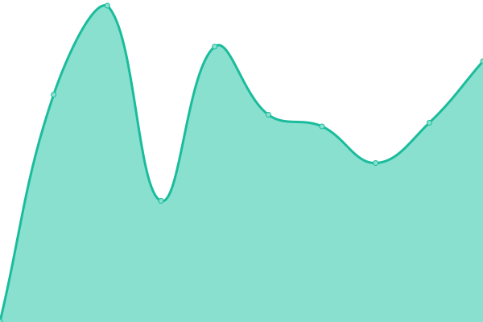
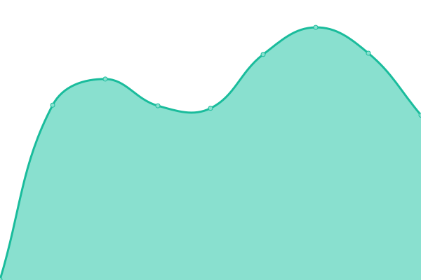
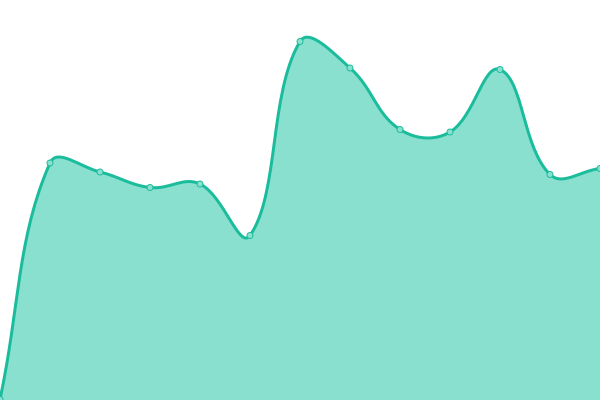
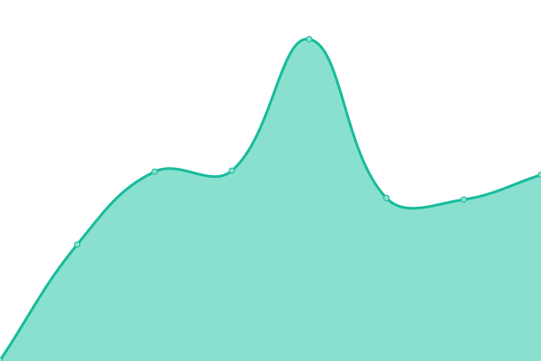
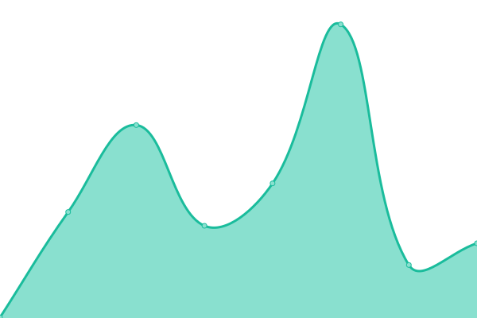

# [📈 Live Status](https://ss14-art.github.io/uptime): <!--live status--> **🟩 All systems operational**

This repository contains the open-source uptime monitor and status page for [ss14.art](https://ss14.art/), powered by [Upptime](https://github.com/upptime/upptime).

With [Upptime](https://upptime.js.org), you can get your own unlimited and free uptime monitor and status page, powered entirely by a GitHub repository. We use [Issues](https://github.com/ss14-art/uptime/issues) as incident reports, [Actions](https://github.com/ss14-art/uptime/actions) as uptime monitors, and [Pages](https://ss14-art.github.io/uptime) for the status page.

<!--start: status pages-->
<!-- This summary is generated by Upptime (https://github.com/upptime/upptime) -->
<!-- Do not edit this manually, your changes will be overwritten -->
<!-- prettier-ignore -->
| URL | Status | History | Response Time | Uptime |
| --- | ------ | ------- | ------------- | ------ |
|  [SS14 Auth](https://auth.ss14.art) | 🟩 Up | [ss-14-auth.yml](https://github.com/ss14-art/uptime/commits/HEAD/history/ss-14-auth.yml) | 

 696ms
     
 | 

<a href="https://ss14-art.github.io/uptime/history/ss-14-auth">91.22%</a>
    

|  [SS14 RSS & Changelog](https://rss.ss14.art) | 🟩 Up | [ss-14-rss-and-changelog.yml](https://github.com/ss14-art/uptime/commits/HEAD/history/ss-14-rss-and-changelog.yml) | 

 579ms
     
 | 

<a href="https://ss14-art.github.io/uptime/history/ss-14-rss-and-changelog">100.00%</a>
    

|  [SS14 Replay](https://replays.ss14.art) | 🟩 Up | [ss-14-replay.yml](https://github.com/ss14-art/uptime/commits/HEAD/history/ss-14-replay.yml) | 

 660ms
     
 | 

<a href="https://ss14-art.github.io/uptime/history/ss-14-replay">100.00%</a>
    

|  [SS14 Website](https://ss14.art) | 🟩 Up | [ss-14-website.yml](https://github.com/ss14-art/uptime/commits/HEAD/history/ss-14-website.yml) | 

 535ms
     
 | 

<a href="https://ss14-art.github.io/uptime/history/ss-14-website">99.85%</a>
    

|  [SS14 Wiki](https://wiki.ss14.art) | 🟩 Up | [ss-14-wiki.yml](https://github.com/ss14-art/uptime/commits/HEAD/history/ss-14-wiki.yml) | 

 371ms
     
 | 

<a href="https://ss14-art.github.io/uptime/history/ss-14-wiki">99.68%</a>
    

|  [SpaceStation14 Website](https://spacestation14.com) | 🟩 Up | [space-station14-website.yml](https://github.com/ss14-art/uptime/commits/HEAD/history/space-station14-website.yml) | 

 164ms
     
 | 

<a href="https://ss14-art.github.io/uptime/history/space-station14-website">100.00%</a>
    

|  [SS14 Hub API](https://hub.spacestation14.com/api/servers) | 🟩 Up | [ss-14-hub-api.yml](https://github.com/ss14-art/uptime/commits/HEAD/history/ss-14-hub-api.yml) | 

 644ms
     
 | 

<a href="https://ss14-art.github.io/uptime/history/ss-14-hub-api">100.00%</a>
    

|  [Ratgore Game Server (TCP)](de.veroid.net) | 🟩 Up | [ratgore-game-server-tcp.yml](https://github.com/ss14-art/uptime/commits/HEAD/history/ratgore-game-server-tcp.yml) | 

 124ms
     
 | 

<a href="https://ss14-art.github.io/uptime/history/ratgore-game-server-tcp">89.89%</a>
    

|  [PostgreSQL (TCP)](de.veroid.net) | 🟩 Up | [postgre-sql-tcp.yml](https://github.com/ss14-art/uptime/commits/HEAD/history/postgre-sql-tcp.yml) | 

 125ms
     
 | 

<a href="https://ss14-art.github.io/uptime/history/postgre-sql-tcp">91.22%</a>
    

|  SS14 Auth API | 🟩 Up | [ss-14-auth-api.yml](https://github.com/ss14-art/uptime/commits/HEAD/history/ss-14-auth-api.yml) | 

 2090ms
     
 | 

<a href="https://ss14-art.github.io/uptime/history/ss-14-auth-api">99.85%</a>
    

<!--end: status pages-->

[**Visit our status website →**](https://ss14-art.github.io/uptime)

## 📄 License

- Powered by: [Upptime](https://github.com/upptime/upptime)
- Code: [MIT](./LICENSE) © [Anand Chowdhary](https://anandchowdhary.com), supported by [Pabio](https://pabio.com)
- Data in the `./history` directory: [Open Database License](https://opendatacommons.org/licenses/odbl/1-0/)
